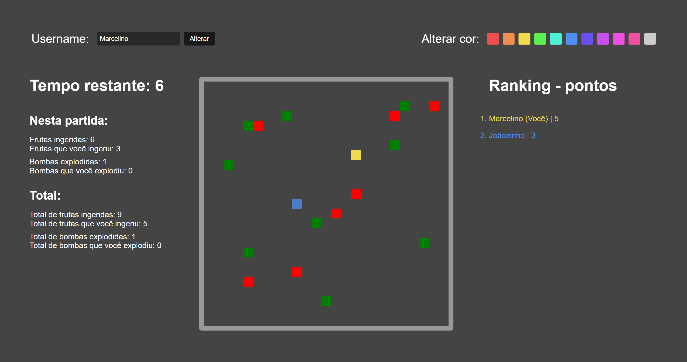

<h1 align="center">
  Multiplayer Pixel Game
</h1>

  <a href="#-tecnologias">Tecnologias</a>&nbsp;&nbsp;&nbsp;|&nbsp;&nbsp;&nbsp;
  <a href="#-projeto">Projeto</a>&nbsp;&nbsp;&nbsp;|&nbsp;&nbsp;&nbsp;
  <a href="#-como-executar">Como executar</a>

 

  

## 🧪 Tecnologias

Esse projeto foi desenvolvido com as seguintes tecnologias:

- [JavaScript]
- [Node.js]
- [Socket.io]
- [HTML]
- [CSS]

## 🚀 Como executar

- Clone o repositório
- Instale as dependências com `npm i`
- Inicie o servidor com `node server.js`

Agora você pode acessar [`localhost:8000`](http://localhost:8000) do seu navegador.

---

<h4 align="center"> Feito com ♥ por Marcelino Teixeira </h4>
